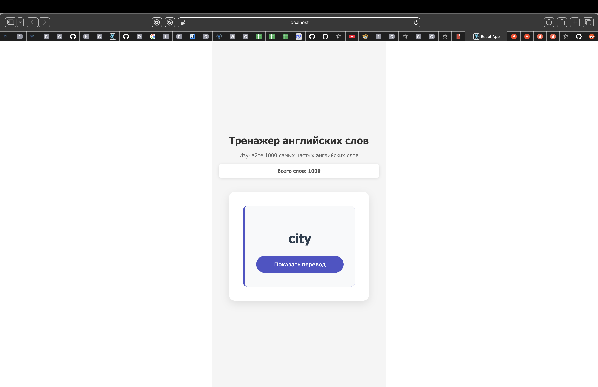
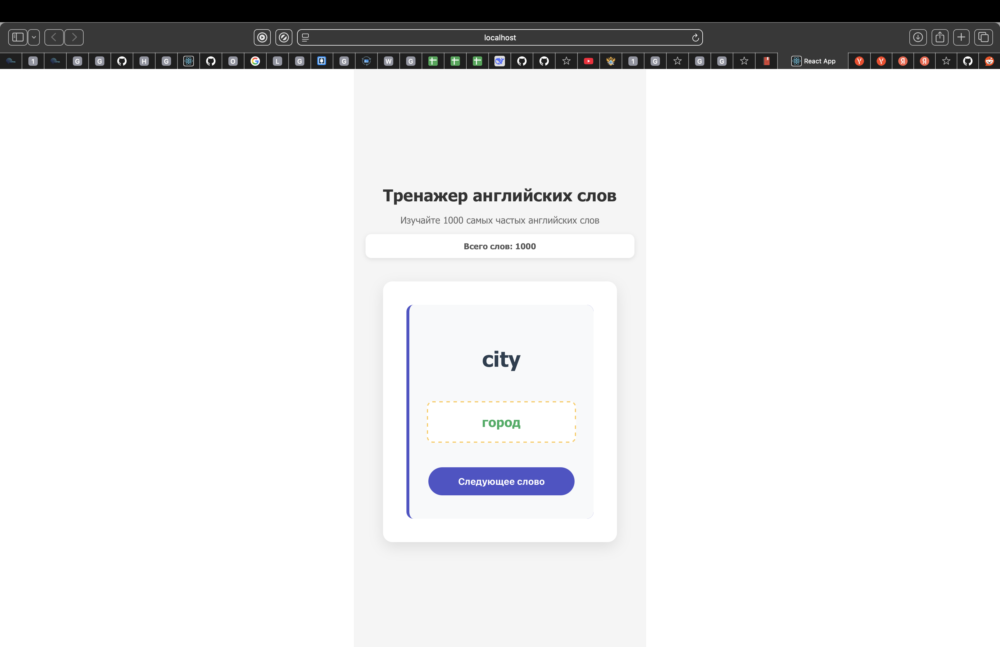

# Отчет по контрольной работе №4
https://mnwa610.github.io/duo_lingo/
## Краткое описание приложения

Разработан "Тренажер английских слов" - учебное приложение на React для запоминания английской лексики. Программа использует базу из 1000 самых употребительных английских слов с русскими переводами и предоставляет интуитивный интерфейс для их изучения.

## Основные возможности

- Обучение по базе из 1000 наиболее распространенных английских слов
- Случайный порядок показа слов для эффективного запоминания
- Поэтапное изучение: сначала отображается английское слово, затем по запросу - перевод
- Адаптивный интерфейс, корректно работающий на компьютерах и мобильных устройствах
- Простой и понятный интерфейс на русском языке

## Особенности реализации

### Используемые технологии:
- React 18 с функциональными компонентами и хуками
- Локальное хранение данных в формате JSON
- Кастомные CSS-стили без внешних зависимостей
- Адаптивная верстка для разных размеров экранов

### Архитектурные особенности:
- Минималистичный дизайн, сфокусированный на основной задаче
- Локальное хранение словаря, не требующее подключения к интернету
- Интуитивная навигация с минимальным количеством элементов управления
- Центрированная компоновка для лучшей концентрации внимания

## Выводы по выполненной работе

### Достигнутые результаты:
- Успешно создано работоспособное React-приложение в соответствии с выбранным вариантом задания
- Реализован основной функционал тренажера для изучения слов
- Практически применены ключевые концепции React: компоненты, состояние, обработка событий
- Обеспечена стабильная работа приложения
- Соблюдены требования к структуре и оформлению проекта

### Перспективы развития:
- Внедрение системы отслеживания прогресса обучения
- Добавление режима проверки знаний
- Группировка слов по тематическим категориям
- Интеграция аудио-произношения слов
- Возможность синхронизации результатов на разных устройствах

## Заключение

Разработанное приложение наглядно демонстрирует освоение основных принципов React-разработки и представляет собой полноценный учебный проект, готовый к практическому применению для изучения английского языка. Кодовая база соответствует современным стандартам качества и может быть расширена дополнительным функционалом.